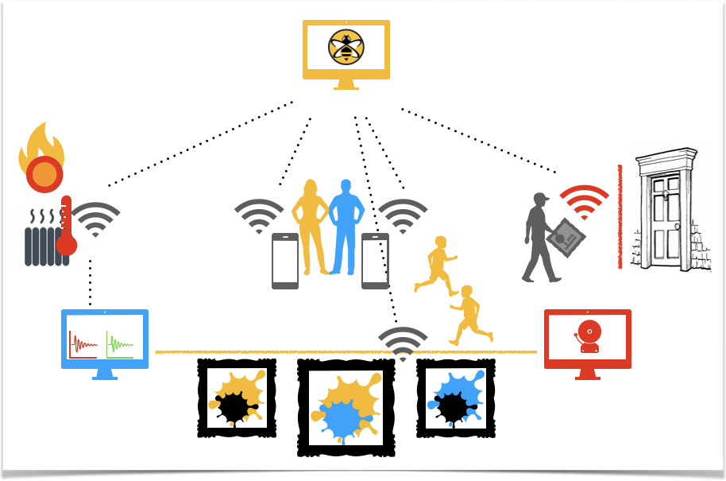
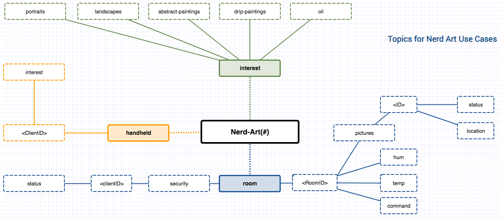

# Workshop MQTT deep dive
These exercises aim to provide a use case scenario in which most MQTT feature can be practically applied.

## General Use Case

We have to organize and run an Exhibition called **_NERD-ART_**. Very expensive paintings from famous artist will be shown. A lot of Visitors were expected.

* The Visitor have to be informed about the Artists, Pictures and further background Information - depending on the Interests of the Visitor.
* The Pictures must be protected from thieves but also from high temperature and humidity fluctuations. 

[pic1]:https://github.com/ahelmbr/mqtt-nerdart-demo/blob/master/exercise/nerd-art/nerdart-usecase.png

The idea is, to use MQTT to improve security, climatic conditions and user experience in an exhibition.
An MQTT broker as the central communications hub will be provided.

### Use Cases

We defined a couple of possible use cases and related exercises. Each use case is described in detail in the sub folder.

**Use case 1: Provide personalized Information of art pieces and picture depending of visitors individual information** 

Exercise 1: Configure and connect your hand held device

Exercise 2: Connect the information service and start periodically publishing news

>see details at subfolder for use case 1 **[Art Piece information](src/main/java/com/mqttdeepdive/exercise/solution/usecase1)**

**Use case 2: Automated control, to ensure optimal temperature and humidity in exhibition rooms.**

Exercise 1: smart sensors and air conditioning unit

>see details at subfolder for use case 2 **[Exhibition Rooms climate control](src/main/java/com/mqttdeepdive/exercise/solution/usecase2)**

**Use case 3: Stop the thief**

Exercise 1: theft prevention for art pieces

>see details at subfolder for use case 3 **[Stop the thief](src/main/java/com/mqttdeepdive/exercise/solution/usecase3)**

 
## Topic structure that should be used for the use case

##Software & Tool Requirements:

**Software**
* Java 11 
* HiveMQ MQTT Client Library 
* HiveMQ4

**MQTT Client Tools**
* MQTT FX or similar tool
* mqtt-cli

**Documentation**
* https://hivemq.github.io/hivemq-mqtt-client/
* https://hivemq.github.io/mqtt-cli/
* https://www.hivemq.com/docs/latest/hivemq/install-hivemq.html